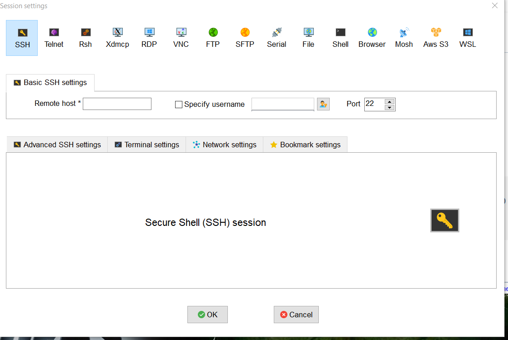

# How to access created instance on your machine using mobaxterm.

#### Step1: Start the EC2 instance created earlier by us, and wait till the time instance is created.

#### Step2: Once the instance is started copy the ip address of the instance. i.e. IPV4 Public IP.

#### Step3: After copying the public ip open mobaxterm installed in the local machine.

#### Step4: Now, start the SSH session.

#### Step5: Now, enter the public ip in the ssh remote ip and use ec2-user as default user name of the ec-instance in mobaxterm. After that set the advance setting in which you have to pass pem file which was downloaded while launcing the instance.

#### Step6: Final step in which the you have accessed the ec2 instance.

