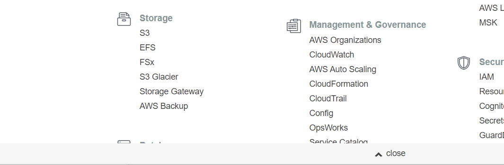
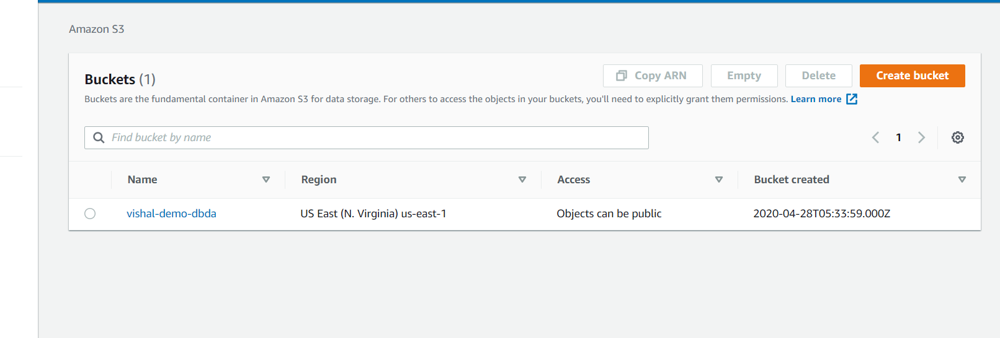
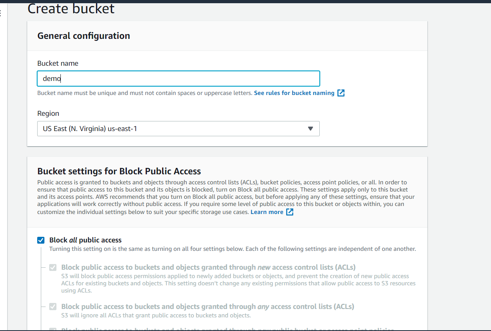
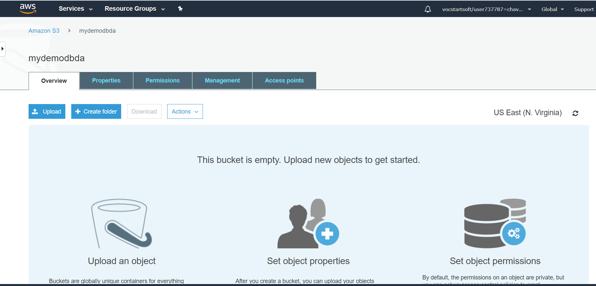

# CREATING S3 BUCKET IN AWS

#### Step1: Go to services, and select S3 in Storage section.

#### Step2: After selecting S3 bucket go to create bucket on the hand side, if you do not have intinally s3 bucket created the overview will be different having create button in the center as in the image below i have created my s3 bucket intially.

#### Step3: In this step, enter the bucket name. Your bucket name should be unique name, as the name given to bucket is global assign and should be unique to global name.

#### Step4: Finally the s3 bucket is created, click on created bucket you will get option to upload,create folder, management,permissions who can access etc.

